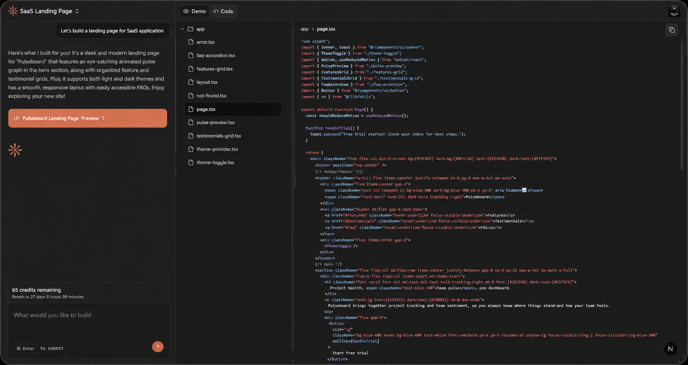

# Vibe

**Build apps and websites by chatting with AI.**

Describe what you want to build and Vibe ships a working app in minutes — with live preview and full source code you can keep, extend, or share.

[Try it now](https://vibe-eight-indol.vercel.app/) · [GitHub](https://github.com/Arijit-mondal099/vibe)

## What is Vibe?

Vibe turns a conversation into a working web app. You tell it what you're building — a landing page, a dashboard, an e-commerce store, anything — and Vibe's AI coding agent designs, codes, and runs the app for you in a safe, sandboxed environment.

No setup, no boilerplate, no staring at an empty editor. Just describe your idea and watch it come to life.

## How it works

### 1. Tell Vibe what you want
Type a prompt like *"Build a Netflix-style homepage with a hero banner, movie sections, and responsive cards"* — or start from one of the built-in templates.

### 2. Vibe builds it live
An AI coding agent plans, writes, and runs your app in real time. You'll see progress in a chat-style timeline as it works.

### 3. Preview, refine, and ship
When it's done, your app is live in a shareable preview. Want changes? Just keep chatting — Vibe updates the app with each follow-up.

## Features

- **Live preview** — Every build runs in a real sandbox, not a mockup. Interact with your app as if it were deployed.
- **Code view** — Explore every generated file in a built-in file tree. Vibe's code is clean, typed, and ready to take with you.
- **Chat to refine** — Keep the conversation going. Ask for new sections, different styles, or bug fixes and Vibe iterates on the same project.
- **Smart templates** — Kick off with a one-click template for Netflix, Spotify, a kanban board, an admin dashboard, and more.
- **Shareable URLs** — Every build has a live URL you can copy and send to anyone.
- **Auto-named projects** — Vibe names each project for you, so your "Vibes" list stays organized.
- **Export** — Once generation finishes, click **Export** on a project to download its complete source as a ZIP. The archive is built from the generated app and served as a private, time-limited download link (no public URLs, no extra setup).

Vibe ships with one-click templates for common ideas — a Netflix clone, an admin dashboard, a kanban board, a file manager, a YouTube clone, a store page, an Airbnb clone, and a Spotify clone — or you can describe something entirely your own.

## Getting started

> **Local setup requires environment variables** — copy `.env.example` to `.env` and fill in your keys before running Vibe. See [CONTRIBUTING.md](CONTRIBUTING.md) for the full list and setup steps.

1. **Create an account** — Sign up in seconds with email or a social login.
2. **Describe your app** — Type a prompt on the home page or pick a template.
3. **Watch it build** — Vibe generates your app live and drops you into the project view.
4. **Preview and refine** — Use the **Demo** tab to interact with your app and the **Code** tab to inspect the source. Send follow-up messages to make changes.
5. **Keep or share** — Copy the live URL, click **Export** to download the project source as a ZIP, or find all your projects anytime under **My Vibes**.

## Credits

Each app build consumes **1 credit**.

| Plan | Credits | Price |
| --- | --- | --- |
| Free | 5 credits / month | $0 |
| Pro | 100 credits / month | $30/mo (or $25/mo billed yearly) |

Pro also unlocks private vibes, priority support, advanced analytics, custom workflows, and early access to new features. See the [pricing page](http://localhost:3000/pricing) for details.

## FAQ

**Do I need to know how to code?**
No. Vibe handles the code, design, and development for you. You just describe the idea.

**What kind of apps can Vibe build?**
Anything that runs in a modern web app — landing pages, dashboards, stores, media players, tools, and more. If you can describe it, Vibe can build it.

**Can I see the code Vibe writes?**
Yes. Every build includes a code view with the full file tree of the generated app.

**Is my work private?**
On the free plan, vibes are public. Upgrading to Pro makes your vibes private.

## Contributing

Vibe is open source and community-driven. Found a bug, have an idea, or want to improve the codebase? Check out [CONTRIBUTING.md](CONTRIBUTING.md) to get started.

## License

Released under the [MIT License](LICENSE).
